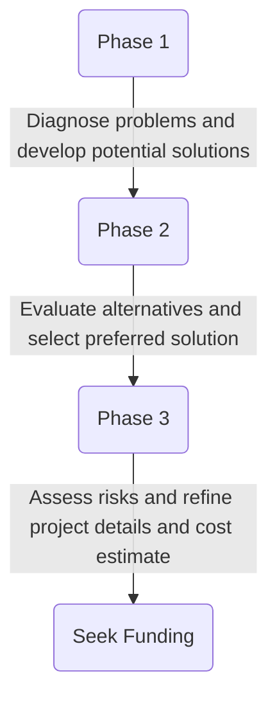

Project Pipeline Study Report 
---
|District 					|{Enter District Name}	|
|:----						|----								|
|Study ID:				|{Enter Study ID}			|
|Jurisdiction(s):		|{Enter Jurisdiction-s}	|

{Enter Study Title}
---
Finalized {Date}

---
Prepared for:
[![OIPI Logo][1]][2]

[1]:  https://oipi.virginia.gov/media/oipi/oipilogo-good.png
[2]:  https://oipi.virginia.gov "Redirect to OIPI homepage"

[![VDOT Logo][3]][4]

[3]:  https://www.vdot.virginia.gov/media/vdotvirginiagov/website-developers-only/site-assets/images/vdot-logo.png
[4]:  https://www.vdot.virginia.gov "Redirect to VDOT homepage"

[![DRPT Logo][5]][6]

[5]:  https://drpt.virginia.gov/wp-content/uploads/2023/03/DRPT-logo.svg
[6]:  https://drpt.virginia.gov "Redirect to vdot homepage"

Prepared by:

---

# Chapter 1 Needs Evaluation and Diagnosis

## Introduction
Project Pipeline is a performance-based planning program to identify cost-effective solutions to multimodal transportation needs in Virginia. Through this planning process, projects and solutions may be considered for funding through programs, including [SMART SCALE](https://smartscale.virginia.gov), revenue sharing, interstate funding, and others. 

Visit the Project Pipeline webpage for additional information: [vaprojectpipeline.org](https://vaprojectpipeline.virginia.gov
). This study focuses on concepts targeting identified needs including congestion mitigation, safety improvement, pedestrian and bicycle infrastructure along the corridor, and transit access. The objectives of Project Pipeline are shown below in Figure 1. 

/prod01/channel_8/va-project-pipeline-home/media/va-project-pipeline/site-images/projectplanning.jpeg)

### Background
The Office of Intermodal Planning and Investment (OIPI) prepared the VTrans Virginia's statewide transportation plan for the Commonwealth Transportation Board (CTB) in which mid-term needs (0 - 10 years) were identified for different categories listed in Table 1. This study focuses on addressing needs identified in VTrans, and those previously identified by the localities.

**List of VTrans Needs**

 - [x] Safety Improvement
 - [ ] Transportation Demand Management
 - [x] Congestion Mitigation
 - [ ] Pedestrian Safety
 - [ ] Transit Access
 - [x] Capacity Preservation
 - [ ] Bicycle Access

### Methodology

The study is broken down into three phases.  The goals of each phase are:

ALTERNATIVE TEXT VERSION OF ABOVE
- **Phase 1** involves problem diagnosis and brainstorming of alternatives
- **Phase 2** is the detailed evaluation of alternatives and selection of preferred solution
- **Phase 3** is the finalization of the preferred alternative in regard to design concept and cost estimate. 

Details on methods and solutions for each study phase are outlined below in Figure 2. The study analysis process is broken down into three main components. Team 1 focuses on Traffic Operations, Capacity, and Access, Team 2 focuses on Road Reliability and Safety, while Team 3 focuses on Rail, Transit, and Transportation Demand Management (TDM), as shown in **Figure 3**. The following details the focus area of study for each team: 
- **Team 1** – Identify operation and access needs by conducting future traffic demand volume forecasts and performing operational analysis of future conditions using Synchro/SimTraffic. Evaluate operational mitigations such as geometric modifications, access management improvements, and installation of facilities for pedestrians and bicycles.  • 
- **Team 2** – Identify safety needs with respect to vehicles, pedestrians, and cyclists by evaluating existing roadway conditions as well as crash patterns and crash hot spot locations based on the most recent five-year crash history obtained from the Virginia Department of Transportation (VDOT) Crash Analysis Tool. Recommend safety improvement options through geometric modifications, access management improvements, and installation of facilities for pedestrians and bicycles.
- **Team 3** –Identify needs with respect to rail, transit, and TDM by reviewing existing rail and transit routes and future traffic demand volume forecasts. Consider improvements that would enhance transit ridership and shift mode choice away from single-occupancy vehicles. 

### Study Area
This is a continuation of a Round 1 Project Pipeline study. The previous study looked at the entire study corridor and recommended multiple alternatives. The following two projects were moved forward to Round 5 SMART SCALE applications: 
1. Offset left-turn lanes at Trade Center Lane (Provided in **Appendix A**) 
2. Roundabout at N Combs Road and a two-way left-turn lane and sidewalk between N Combs Road and Cecil Street (Provided in **Appendix B**) 

Neither of these SMART SCALE applications were selected for funding in Round 5 of SMART SCALE. This current process, in Round 2 of Project Pipeline, is to conduct value engineering of those two SMART SCALE applications to develop more competitive funding applications. The value engineering effort includes analyzing previous SMART SCALE scores, improving the project benefits, reducing project costs, and better defining project scope to reduce project risk. The original study corridor was Alt US 58 (W Morgan Avenue / Trail of the Lonesome Pine Road) from east of Sugar Run Road to Cecil Street in Lee County, Virginia. The 4.5-mile Alt US 58 corridor is classified as a rural minor arterial road within the study area and is on the Corridors of Statewide Significance (CoSS). A map detailing the general location of the Alt US 58 study area is shown below in Figure 4. The two focus areas of this study corridor are at Trade Center Lane and between N Combs Road and Cecil Street. At Trade Center Lane, Alt US 58 has a speed limit of 55 MPH and is a four-lane divided roadway. Between N Combs Road and Cecil Street, the speed limit is 35 MPH and the corridor is a two-lane undivided roadway.

*Figure 4 - Map of the Study Area*
/prod01/channel_8/va-project-pipeline-home/media/va-project-pipeline/bristol/br-23-10-website-updated.jpg "Map of the Study Area showing study area as Alternate Route 58 from Combs Road to Cecil Street.")

VTrans is Virginia’s statewide transportation plan. It identifies and prioritizes locations with transportation needs using data-informed transparent processes. The policy for identifying VTrans mid-term needs establishes multimodal need categories that correspond to the Commonwealth Transportation Boardadopted VTrans visions, goals, and objectives.1 Each need category has one or more performance measures and thresholds to identify one or more needs. Visit the VTrans policy guide for additional information: https://vtrans.org/resources/VTrans_Policy_Guide_v6.pdf. The mid-term needs, as identified in VTrans for the Alt US 58 study corridor, were identified as ‘Very High’ for one need area, ‘High’ for one need area, ‘Low for one need area, and 'None' for eight need areas, as presented in **_Table 2_**.

**_Table 2_**: VTrans Needs in the Study Area

|**VTrans 2019 Mid-Term Need**							|**District Priority**	|
|-------------------------------------------------------|-----------------------|
|Congestion												|None					|
|Reliability											|None					|
|Transit Access	to Equity Emphasis Areas				|None					|
|Transit Access to Activity Centers						|None					|
|Pedestrian Access										|None					|
|Bicycle Access											|None					|
|Access to Industrial and Economic Development Areas	|None					|
|Road Safety											|**High**				|
|Capacity Preservation									|**Very High**			|
|Travel Demand Management								|**Low** 				|
|Pedestrian Safety										|None					|

These mid-term needs, identified in VTrans, are prioritized on a tier from 1 to 4, with 1 being the most critical and 4 being the least critical. The segments ranked as “Priority 1” represent those with multiple categories identified as high in need. Figure 5 presents a map of the study area with 2019 VTrans  mid-term needs prioritized for district attention. As can be seen in the figure, a large part of the study corridor has Priority 3 needs, with a segment to the west with Priority 2 needs. The VTrans needs for the 1Commonwealth Transportation Board, Actions to Approve the 2019 VTrans Vision, Goals, Objectives, Guiding Principles and the 2019 Midterm Needs Identification Methodology and Accept the 2019 Mid-term Needs, January 15, 2020 12 Trade Center Lane intersection are shown in Table 3, and the VTrans needs between N Combs Road and Cecil Street are shown in Table 4. 

### Underway Projects, Previous Studies, and Planning Documents

{{insert text describing current projects, previous studies and/or other useful planning documents}}

## Traffic Operations and Accessibility

Initial diagnosis of the traffic operations and accessibility issues along the US 19/460 corridor was completed via traffic count data, field and aerial imagery review, and geospatial analysis. 

### Traffic Data

Traffic volume data (i.e., vehicle turning movement counts and 72-hours of volume and speed counts at two locations) was collected in May 2023 for the Pipeline Study. Peak hour turning movement counts and the raw traffic volume data are provided in Appendix A. VDOT’s 2021 Average Annual Daily Traffic (AADT) for the US 19/460 study corridor is reported as follows: 
- US 19 Western Intersection to SR 639 Earl’s Branch Road: 9,800 Vehicles per Day (VPD)
- SR 639 Earl’s Branch Road to Tazewell County’s western border: 8,900 VPD

The 72 hours of collected volume and speed data were graphed to evaluate the temporal distribution over the data collection period. Figure 6 shows the US 19/460 volume and speed distribution for the data collected between Limestone Road and Cuz’s Cabins and Restaurant, and Figure 7 shows the US 19/460 volume and speed distribution for the data collected between Lincoln Street and Mountain Road. In both figures, the 15-minute vehicle volume is plotted on the left vertical axis and the mean speed (MPH) is plotted on the right vertical axis. The figures show that the corridor has a relatively consistent volume level throughout the day, with only minor morning and evening peaks. The temporal speed distribution is relatively constant throughout the data collection period.  Table 4 presents volume and speed statistics derived from the 72-hour data collection, including average daily traffic, mean speed, 85th percentile speed, percent of traffic traveling above the speed limit, and vehicle fleet composition. These statistics reveal that both ends of the study corridor carry approximately the same daily traffic, there is a significant speeding issue on the corridor (due to the 85th percentile speed exceeding the posted speed limit by approximately 11 MPH), and there is a relatively significant quantity of truck traffic on the corridor.

 is plotted on the right vertical axis. The figure show that the corridor has a relatively consistent volume level throughout the day, with only minor morning and evening peaks. The temporal speed distribution is relatively constant throughout the data collection period.")

|	5/16 to 5/18 Data Collection		|	Average Daily Traffic (ADT)	|Mean Speed 		|85th Percentile Speed		|Speed Notes (% of traffic)		|Vehicle Composition	|
|--|--|--|--|--|--|
|Between Limestone Rd and Cuz's Cabins and Restaurant	|11,418	|64.69 mph	|71.67 mph	|83.1% > SL of 60 mph 53.1% > SL + 5 mph 22.5% > SL + 10 mph|82% 22 ft 22ft < 13% <45 ft 5% > 45 ft|
|Between Lincoln St and Mountain Rd	|10,765	|64.82 mph	|70.81 mph	|83.4% > SL of 60 mph 45.6% > SL + 5 mph 16.5% > SL + 10 mph|65% 22 ft 22ft < 30% <45 ft 5% > 45 ft|

### Measures of Effectiveness
There are many measures of effectiveness (MOE) in traffic operations analysis to quantify operational and accessibility metrics and provide a basis for evaluating the performance of a transportation network. A summary of the MOEs evaluated for the study corridor during the Phase 1 analysis is presented below:

**Intersection Operations Metrics (Computed in Synchro/SimTraffic)**
- Control Delay (measured in seconds per vehicle – sec/veh)
- Level of Service (LOS)
- Maximum Queue Length (measured in feet – ft)

### Traffic Operations Analysis Results
In Phase 1, a traffic operational analysis was performed using Synchro 11 software for the intersections along the US 19/460 corridor. Synchro is a traffic operations software package that is based upon Highway Capacity Manual (HCM) calculations. Utilized inputs and analysis methodologies are consistent with the VDOT Traffic Operations and Safety Analysis Manual (TOSAM) guidelines. AM and PM peak hour analyses were performed for the peak hour traffic volume dataset.

Table 5 presents the AM and PM peak hour Synchro analysis intersection LOS summary (reports included in Appendix A). As all four intersections are two-way stop-controlled, the LOS/delay for the worst operating approach is reported. As indicated in the table, there is no significant delay at the study intersections on this corridor.

*TABLE 5: Synchro Delay and Level of Service (LOS) for Worst Approach*
|Intersection  |Existing AM LOS  |Existing AM Delay (sec)|Existing PM LOS  |Existing PM Delay (sec)|
|--|--|--|--|--|
|Limestone Rd  |B  |12.4|B|11.3|
|Median Crossover |A  |0|A|0|
|Earl's Branch Rd  |B  |11.1|A|9.9|
|Keen Rd  |B  |10.0|B|11.1|
|Pounding Mill Branch Rd/Cochran Hollow Road  |B  |14.5|C|15.8|

### “S” Curve Appropriate Design Speeds
VDOT design standards, based on the American Associated of State Highway and Transportation Official’s (AASHTO’s) A Policy on Geometric Design of Highways and Streets, dictate minimum curve radii dependent upon design speed and curve superelevation. As such, the process can be reversed to determine the appropriate operating speed that a curve’s superelevation and radius are designed to accommodate. Table 6 shows the radii and super-elevations of the western and eastern curves within the “S” curve immediately east of Earl’s Branch Road, and thus what the appropriate design speed should be based on these values. The current posted speed limit on US 19/460 is 60 MPH, and the speed data shows that the 85th percentile speed is 11 MPH above the posted speed limit. As such, the operating speed of traffic through the “S” curve significantly exceeds the curvature design speed.

*Table 6: Curve Radii and Design Speed*
|Location|Direction|Superelevation|Actual Radius|Appropriate Design Speed|
|--|--|--|--|--|
|Western Curve|EB Direction|12%|1,148 ft|60 MPH|
|Western Curve|WB Direction|8%|1,146 ft|55 MPH|
|Eastern Curve|EB Direction|6%|1,432 ft|60 MPH|
|Eastern Curve|WB Direction|8%|1,432 ft|60 MPH|

### Other Operations and Access VTrans Needs
The US 19/460 study corridor has additional VTrans needs in the areas of accessibility, including transportation demand management (TDM) (low priority) and capacity preservation (very high priority). The VTrans needs are identified via a statewide screening process and must be considered through the context of the local corridor. The needs help identify corridors for additional analysis but do not necessarily indicate a transportation need. Each of these two VTrans needs are discussed in more detail in the following section.

The TDM VTrans need is automatically assigned to non-limited access facilities that are on the Corridors of Statewide Significance (CoSS), such as US 19/460. This assignment is indicative of the importance of these statewide transportation arteries to moving people and goods. The goal of TDM in general is to convert private automobile trips to carpools or multimodal (transit, walk, bike, etc.). The context of the US 19/460 study corridor is not conducive to these types of trip conversions.

The capacity preservation VTrans need is automatically assigned to corridors on the Arterial Preservation Network (APN), which is a network of VDOT-maintained roads that function similarly to the interstate system in that they convey people and goods across the state. As such, VDOT has prioritized preserving mobility on these corridors. Mobility can be hindered when there is either recurring congestion or significant safety concerns that could induce non-recurring congestion. As already documented, the recurring operations of this corridor are readily accommodated, so the capacity preservation on this corridor is more correlated to the safety performance.

## Safety and Reliability
For the analysis of existing safety conditions, the VDOT Crash Analysis Tool was utilized to determine the crash history at the study intersections along the study corridor. Crash data was collected and analyzed for a five-year period spanning from January 2018 to December 2022. The study team reviewed the crash details provided by VDOT as well as the FR300 crash reports to determine specific trends. The study team also performed geospatial analysis to identify “hot spot” areas for consideration in developing alternative improvement concepts. On the US 19/460 study corridor, there was no “reliability” VTrans need, so this topic area was not considered. Reliability is defined as the consistency of expected travel time along a corridor; as previously reported, the operations of this corridor are fine.
### Safety Analysis Results

#### VDOT SAFETY SCREENING
Through a systemic analysis methodology that incorporates bicycle/pedestrian crash history, roadway characteristics, proximity to pedestrian generating land uses, and socioeconomic data, VDOT identifies a Pedestrian Safety Action Plan (PSAP) roadway network of high-risk corridors. US 19/460 through the study area is not a PSAP segment given its rural nature and minimal pedestrian activity.
VDOT also conducts safety screening analysis at a network level to identify critical hot spots where crashes are statistically overrepresented. A metric called Potential for Safety Improvement (PSI) is computed that identifies locations where actual crashes are overrepresented compared to what would be anticipated for a roadway of those characteristics. The top 100 intersections and segments are then ranked by PSI in each VDOT District. Figure 9 shows that the US 19/460 study corridor contains none of the top 100 segments, but contains the 131st segment within the Bristol District, conveying the safety need at this location along the corridor.

#### CRASH ANALYSIS
The 35 non-animal crashes within the study area are summarized by type and severity in Figure 10. Nearly two-thirds of non-animal crashes were fixed object run-off-road crashes. The significant percentage of off-road crashes is reflective of the corridor design and vehicle travel speeds, as the 85th percentile speed of vehicles is higher than the appropriate design speed for several of the horizontal curves. Figure 11 displays a heat (density) map of all crashes on the corridor; they are clearly clustered at PSI segment #131 (Figure 9). This is the location of the “S” curve previously discussed and the eastbound direction also has a downgrade. At this location there were 16 fixed object off-road crashes, eight of which were on the “S” curve. Most of these crashes only involved property damage, however there was one fatal crash and two that involved a severe injury. Most of these crashes also occurred in the eastbound direction.

Figure 11: US 19/460 Crash Heat (Density) Map

Animal crashes are another significant crash type present in this study corridor. There were 32 reported animal crashes over the past five years. Research by the Virginia Transportation Research Council (VTRC) indicates that the number of actual animal crashes may be five times greater than the number of reported animal crashes. Many of these animal crashes occurred in the dark and in the westbound direction where the river is closest to the roadway. Figure 12 shows a heatmap of the animal crashes on US 19/460. As shown in the figure, there are three hotspot locations. Animals involved in crashes included deer, bears, and cows, and these crashes had a high seasonal concentration with peak months in June, November, and December.

> Written with [StackEdit](https://stackedit.io/).
